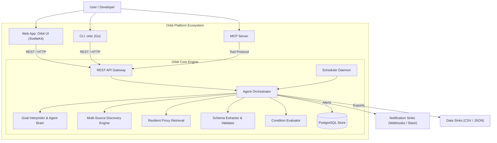

# Orbit

**Autonomous Goal-Driven Web Data Operations**

> *"Set the goal. Walk away."*

[](LICENSE)
[](cli/)
[](core/)
[](app/)

Orbit is an autonomous web-data operations platform. Instead of hand-crafting brittle web scrapers, reverse-engineering dynamic page selectors, or constantly maintaining bespoke crawling pipelines, you specify data requirements in plain natural language.

Orbit interprets your objective, derives structured extraction schemas, discovers relevant web sources, retrieves content via resilient proxy infrastructure, extracts typed records, performs anomaly and schema validation, evaluates condition triggers, and runs automatically on a recurring schedule with end-to-end provenance.

---

## Core Capabilities

- **Natural-Language Goal Interpretation**: Provide goals such as *"Every morning at 8 AM, find the cheapest flights from Lagos to London in December and alert me if under $800"*. Orbit synthesizes domain plans, extraction schemas, and search queries automatically.
- **Universal and Domain Agnostic**: Operates across e-commerce, real estate, job listings, travel, financial data, and news without requiring domain-specific scrapers.
- **Agentic Self-Correction**: When discovery yields empty results or page structures change, an autonomous Agent Brain diagnoses the issue and refines search queries or retrieval strategies in real time.
- **Verification and Anomaly Detection**: Extracted datasets are validated against dynamically generated JSON schemas and inspected for anomalies, ensuring verified data reaches downstream systems.
- **Condition Triggers and Alerts**: Evaluates expressions (such as `min(price) < 400000` or `salary >= 150000`) and dispatches instant notifications via webhooks or notification sinks.
- **Daemonized Scheduling**: Configures recurring intervals (`hourly`, `daily`, `weekly`, `monthly`) powered by a persistent background scheduler.
- **Immutable Provenance Trail**: Complete audit trail for every run, including search queries, discovered URLs, raw HTML/markdown snapshots, validation errors, and LLM reasoning steps.

---

## System Architecture

Orbit operates as a modular platform consisting of an autonomous execution daemon, a cross-platform command-line client, a modern telemetry web application, and extensible protocol adapters:



---

## Repository Structure

The Orbit repository is structured as a monorepo containing:

| Component | Directory | Description | Documentation |
|-----------|-----------|-------------|---------------|
| **Core Engine** | [`core/`](./core) | Python backend daemon: Agent Orchestrator, LLM pipeline, APScheduler, PostgreSQL ORM, and FastAPI REST API. | [Core Docs](./core/README.md) |
| **Web Application** | [`app/`](./app) | Mission control web dashboard built with SvelteKit, Tailwind CSS, and Svelte 5 Runes. | [App Docs](./app/README.md) |
| **CLI (`orbc`)** | [`cli/`](./cli) | High-performance Go CLI for interactive goal submission, manual runs, data exports, and daemon management. | [CLI Docs](./cli/README.md) |
| **MCP Server** | [`mcp/`](./mcp) | Model Context Protocol adapter enabling AI agents (Claude Desktop, Cursor, Zed) to operate Orbit. | [MCP Docs](./mcp/README.md) |

---

## Quickstart

### 1. Launch the Orbit Core Daemon

Follow the [Core Setup Guide](./core/README.md) to start the database and backend:

```bash
# 1. Start PostgreSQL
docker run --name orbit-pg -e POSTGRES_USER=orbit -e POSTGRES_PASSWORD=orbit -e POSTGRES_DB=orbit -p 5432:5432 -d postgres:16

# 2. Configure environment
cp core/.env.example .env

# 3. Launch Core server
python -m venv core/venv
source core/venv/bin/activate  # Windows: .\core\venv\Scripts\Activate.ps1
pip install -e ".[dev]"
uvicorn core.app:app --reload --port 8000
```

### 2. Launch the Web Application

```bash
cd app
pnpm install
pnpm dev
```

The web dashboard will be available at `http://localhost:5173`.

### 3. Install and Use the `orbc` CLI

```bash
# Build the CLI
cd cli
make build

# Create an automation from a natural language goal
orbc goal "Every day at 8 AM, find the cheapest PlayStation 5 in Nigeria and alert if price < 400000 NGN"

# Run an automation immediately
orbc run <automation_id>

# View extracted results in aligned tables or export to CSV/JSON
orbc data <run_id> --format table
orbc data <run_id> --format csv > ps5_prices.csv

# Inspect full provenance and verification audit trail
orbc show <run_id>
```

---

## Example Goals

| Objective | Natural Language Goal |
|---|---|
| **E-Commerce and Arbitrage** | `"Daily at 9 AM, track prices for Sony WH-1000XM5 headphones across top retailers and alert me if price drops below $300"` |
| **Tech Hiring and Job Market** | `"Weekly on Monday, find remote Principal Go Engineer roles offering over $180,000 and export to CSV"` |
| **Travel and Flights** | `"Every 12 hours, find round-trip flights from New York to Tokyo under $900 for dates in November"` |
| **Real Estate Monitoring** | `"Every morning, find 2-bedroom apartments for rent in Lekki Phase 1 under 4,000,000 NGN/yr"` |
| **Regulatory and News Tracking**| `"Every 6 hours, monitor news mentions of 'open source AI regulations' across primary tech news portals"` |

---

## License

This project is licensed under the MIT License — see the [LICENSE](LICENSE) file for details.
